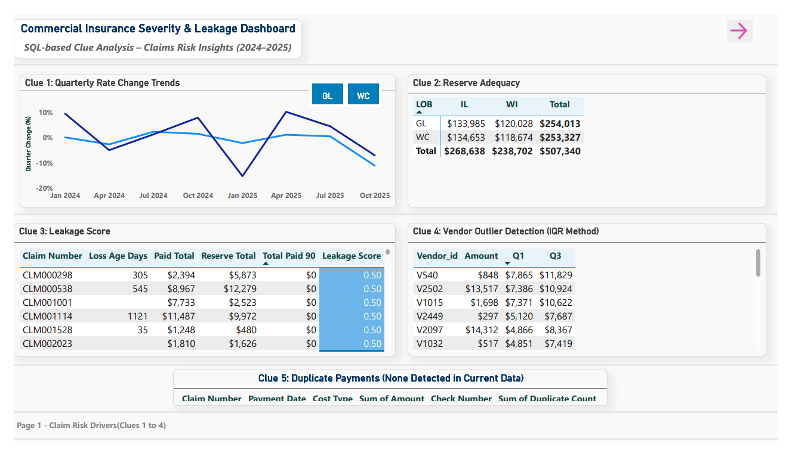
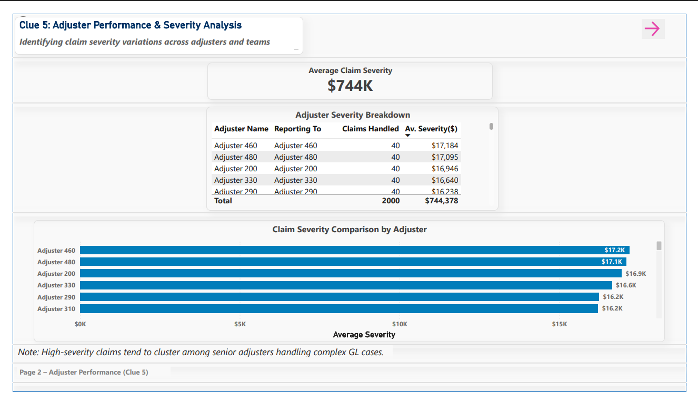
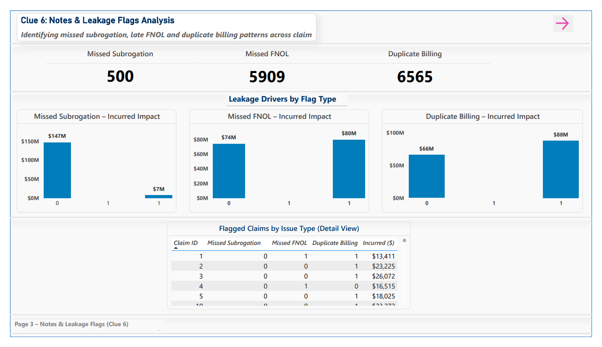
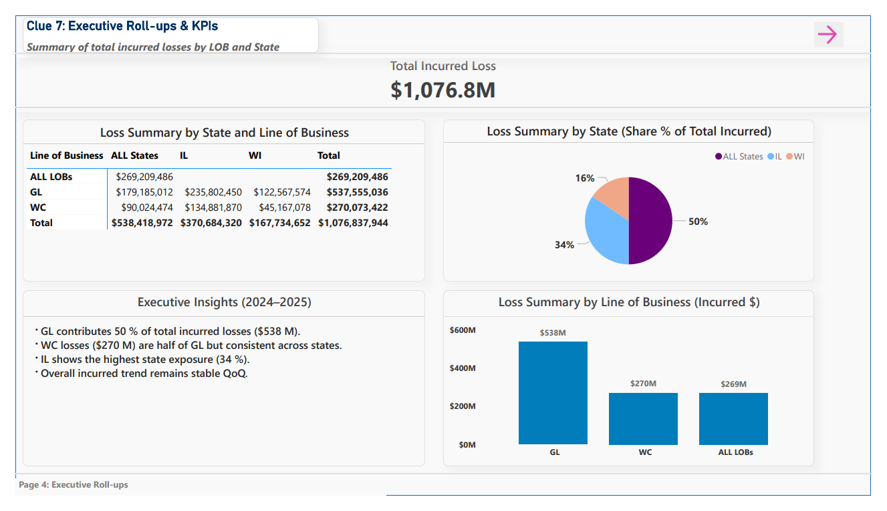

# Commercial Insurance Severity & Leakage (SQL Case Study + Power BI Visuals)

**End-to-End:** SQL Server (ETL + Analysis) → Power BI (Visualization)

**Overview**  
**Data Pipeline Flow:** staged (messy data) → core (cleaned data) → mart (data for visualization).  
Identifies **severity QoQ hotspots**, **reserve-leakage flags**, **vendor IQR outliers**, and notes-based red flags such as **missed subrogation** and **late FNOL**, leading to a final **risk-score view**.

**Quick links**  
• [`sql/`](sql) – scripts in run order  
• [`results/`](results) – sql outputs in CSV samples  
• [`visuals/`](visuals) – Power BI Visuals

**Why it’s useful**  
• Real insurance scenarios (leakage, reserves, subrogation, late FNOL)  
• Clear run order + small sample outputs for quick review  
• Uses **window functions** (LAG, ROW_NUMBER, PERCENTILE_CONT), **recursive CTE**, **GROUPING SETS**

---

## 📂 Outputs at a glance (CSV in `/results`)
- **Severity QoQ hotspots (top 5):** `results/clue1_severity_hotspots_top5.csv`  
- **Reserve flags (top 100):** `results/clue2_reserve_flags_top100.csv`  
- **Vendor outliers – high (top 50):** `results/clue4_vendor_outliers_high_top50.csv`  
- **Notes flags (top 50):** `results/clue6_notes_flags_top50.csv`  
- **Risk signals view (top 50):** `results/claim_risk_signals_top50.csv`  
- **Duplicate payments:** none returned under same **date + cost_type + amount + check_number**

---

### 💡 Key Insights from Analysis 
- Severity spikes and reserve adequacy issues  
- Vendor anomalies and duplicate billing patterns  
- Missed subrogation and late FNOL trends

---

## 📊 Power BI Dashboard Overview  
This Power BI report builds directly on the SQL case study results, transforming the extracted insights into interactive visual dashboards for executive and analytical review.  

Each dashboard page represents a different analytical *Clue* in the end-to-end risk and leakage detection process.

| Page | Description |
|------|--------------|
| **1. Claim Risk Drivers** | Shows rate change trends, reserve adequacy by state and LOB, leakage scoring, and vendor outlier detection using IQR. |
| **2. Adjuster Performance** | Highlights adjuster-level claim severity patterns and workload distribution. Identifies clusters of high-severity adjusters. |
| **3. Leakage Flags Analysis** | Visualizes missed subrogation, late FNOL, and duplicate billing impact across claims. |
| **4. Executive Roll-ups & KPIs** | Summarizes total incurred losses by Line of Business and State with executive insights and trend commentary. |

---

### 🖼 Power BI Dashboard Preview
| Page 1 | Page 2 | Page 3 | Page 4 |
|:--:|:--:|:--:|:--:|
|  |  |  |  |

---

