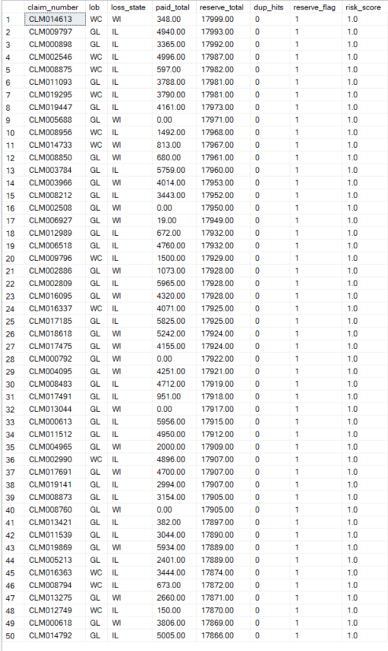

# Severity & Leakage - SQL Case Study

**Overview**  
End-to-end T-SQL: staged → core → mart. Finds **severity QoQ** hotspots, **reserve-leakage** flags, **vendor IQR** outliers, notes-based red flags (missed subrogation, late FNOL), and a final **risk-score view**.

**Why it’s useful**  
• Real insurance scenarios (leakage, reserves, subrogation, late FNOL)  
• Clear run order + small sample outputs for quick review  
• Uses **window functions** (LAG, ROW_NUMBER, PERCENTILE_CONT), **recursive CTE**, **GROUPING SETS**

  
**Quick links**  
• [`sql/`](sql) – scripts in run order  
• [`results/`](results) – tiny CSV samples  
• [`images/`](images) – screenshots

---

## Contents
1) How to run (5 scripts)  
2) Outputs at a glance (CSV)  
3) Screenshots  
4) What this shows    

---

## How to run (SQL Server / SSMS)
1. Open `sql/01_create_db_and_staging.sql` → **Execute**  
2. Switch database to **SeverityLeakageCase**  
3. Run, in order:  
   - `sql/02_core_etl.sql`  
   - `sql/03_quality_checks.sql`  
   - `sql/04_analysis_clues.sql`  
   - `sql/05_mart_views.sql`

---

## Outputs at a glance (CSV in `/results`)
- **Severity hotspots (top 5):** `results/clue1_severity_hotspots_top5.csv`  
- **Reserve flags (top 100):** `results/clue2_reserve_flags_top100.csv`  
- **Vendor outliers – high (top 50):** `results/clue4_vendor_outliers_high_top50.csv`  
- **Notes flags (top 50):** `results/clue6_notes_flags_top50.csv`  
- **Risk signals view (top 50):** `results/claim_risk_signals_top50.csv`  
- **Duplicate payments:** none returned under same **date + cost_type + amount + check_number**

---

## Screenshots (in `/images`)

- `images/clue1_hotspots.png`  
- `images/clue2_reserve_flags.png`

## What this shows
- **End-to-end pipeline:** messy staging → clean core → analytics view  
- **Business findings:** severity spikes, reserve adequacy issues, vendor anomalies, missed subrogation / late FNOL  
- **SQL depth:** window functions (LAG, ROW_NUMBER, PERCENTILE_CONT), recursive CTE hierarchy, GROUPING SETS

---

