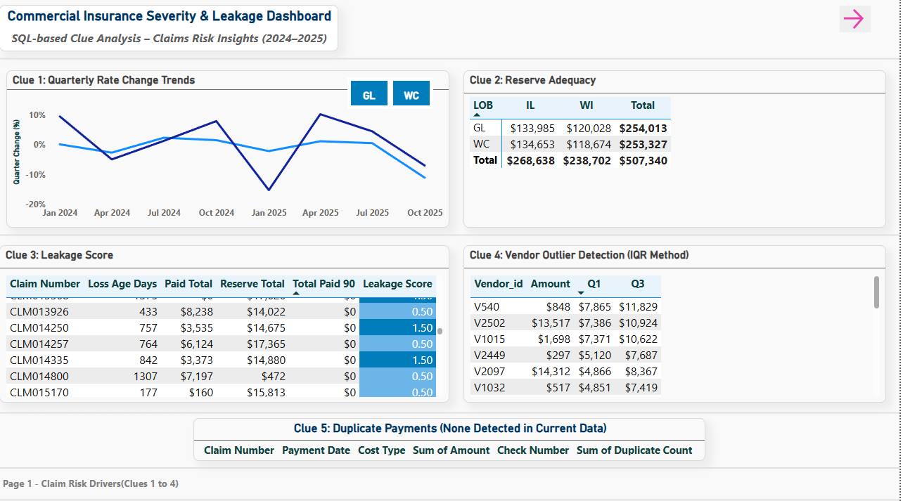

# Commerical Insurance Severity & Leakage - (SQL Case Study + Power BI Visuals)

**Overview**  
End-to-end T-SQL: staged → core → mart. Finds **severity QoQ** hotspots, **reserve-leakage** flags, **vendor IQR** outliers, notes-based red flags (missed subrogation, late FNOL), and a final **risk-score view**.

**Why it’s useful**  
• Real insurance scenarios (leakage, reserves, subrogation, late FNOL)  
• Clear run order + small sample outputs for quick review  
• Uses **window functions** (LAG, ROW_NUMBER, PERCENTILE_CONT), **recursive CTE**, **GROUPING SETS**

  
**Quick links**  
• [`sql/`](sql) – scripts in run order  
• [`results/`](results) – sql outputs in CSV samples  
• [`visuals/`](visuals) – Power BI Visuals

---

## Outputs at a glance (CSV in `/results`)
- **Severity hotspots (top 5):** `results/clue1_severity_hotspots_top5.csv`  
- **Reserve flags (top 100):** `results/clue2_reserve_flags_top100.csv`  
- **Vendor outliers – high (top 50):** `results/clue4_vendor_outliers_high_top50.csv`  
- **Notes flags (top 50):** `results/clue6_notes_flags_top50.csv`  
- **Risk signals view (top 50):** `results/claim_risk_signals_top50.csv`  
- **Duplicate payments:** none returned under same **date + cost_type + amount + check_number**

---

## What this shows
- **End-to-end pipeline:** messy staging → clean core → analytics view  
- **Business findings:** severity spikes, reserve adequacy issues, vendor anomalies, missed subrogation / late FNOL  
- **SQL depth:** window functions (LAG, ROW_NUMBER, PERCENTILE_CONT), recursive CTE hierarchy, GROUPING SETS

---

## 📊 Power BI Dashboard Overview  
This Power BI report builds directly on the SQL case study results, transforming the extracted insights into interactive visual dashboards for executive and analytical review.  

Each dashboard page represents a different analytical *Clue* in the end-to-end risk and leakage detection process.

| Page | Description |
|------|--------------|
| **1. Claim Risk Drivers** | Shows rate change trends, reserve adequacy by state and LOB, leakage scoring, and vendor outlier detection using IQR. |
| **2. Adjuster Performance** | Highlights adjuster-level claim severity patterns and workload distribution. Identifies clusters of high-severity adjusters. |
| **3. Leakage Flags Analysis** | Visualizes missed subrogation, late FNOL, and duplicate billing impact across claims. |
| **4. Executive Roll-ups & KPIs** | Summarizes total incurred losses by Line of Business and State with executive insights and trend commentary. |

---

### 🖼 Power BI Dashboard Preview
| Page 1 | Page 2 | Page 3 | Page 4 |
|:--:|:--:|:--:|:--:|
|  |  |  |  |

---

